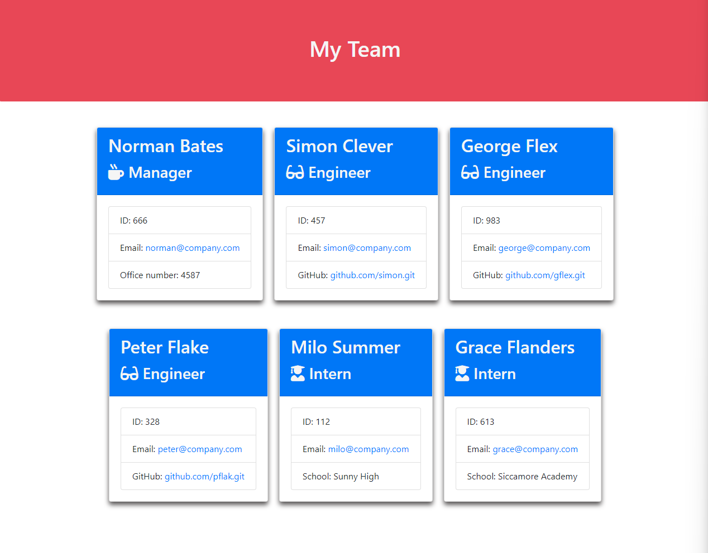

# Team Profile Generator

## Description
#
Team Profile Generator is a Node.js command-line application that will generate a HTML web page with a the team profile. By following simple instructional prompts. Couldn't be easier!
 
 
Example screenshot

## Table of Contents
#

- [Description](#description)
- [Installation](#installation)
- [Usage](#usage)
- [License](#license)
- [Contributing](#contributing)
- [Tests](#tests)
- [Questions](#questions)
 
 
## Installation
#
Clone the the GitHub repository to your compuer, install Node and run Index.js. 
 
 

## Usage
#
After installing, see the installation guide, run index.js and follow the command-line prompts with information about your team.
 
 

## License
#
### This roject is covered under the:
* The MIT License
 
 

## Contributing
#
Contact the developer through GitHub.
 
 

## Tests
#
Contact the developer for information.
 
 

## Questions
#

### GitHub Repository Ror The Reveloper:
- https://github.com/QByter
 

### Deployed Link
- https://qbyter.github.io/Team-Profile-Generator/

### Example Team Profile Web Pag
- https://qbyter.github.io/Team-Profile-Generator/example.html

### Technologies Used:
* Object-Oriented Programming
* Node.js
* JavaScript
* HTML
* CSS

### Contact details:
- Contact me via GitHub with any questions, suggestions or collaboration ideas.
 
 
 
 

##### 
QByter 2023

